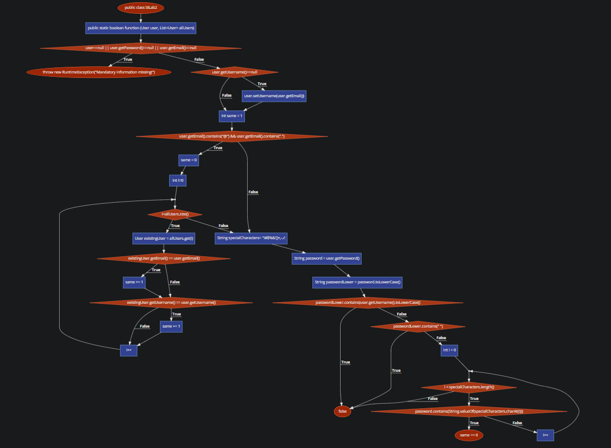

# SI_2023_lab2_212088

#Ведран Илиевски 212088

#Control Flow Graph

#Цикломатска комплексност
28 jazli 35 rebra
35-28+2=9
цикломатската комплексност = 9

#Тест случаи според критериумот Every statement
1.Тест случај за првиот if (mandatory information missing):

Влез: user = null, allUsers = [user1, user2]
Во овој тест случај, го поставивме user на нула за да симулираме сценарио каде 
недостасуваат задолжителни информации. Исто така обезбедуваме непразна листа на allUsers. 
Кодот треба да фрли RuntimeException со пораката 
Mandatory information missing! бидејќи user е null.

2.Тест случај за вториот if (username is null):

Влез: user = new User(null, "password123", "user@example.com"), allUsers = []
Овде, создаваме user со null username, но валидни вредности за password и email. 
allUsers е празна. Кодот треба да го постави username на user на вредноста на 
полето за email (бидејќи user.getUsername() е null). 

3.Тест случај за третиот if (email validation and existing user check):

Влез: user = new User("username1", "password123", "user@example.com"), allUsers = [user1, user2]
Во овој тест, креираме user со важечко username, password и email. 
allUsers содржи уште две users. Целта на овој тест случај е да се провери валидацијата 
на email и постоечката логика за проверка на user. 
Очекуваното однесување е дека истата променлива треба да се зголеми за секој постоечки user
кој го има истиот email или username како тековниот user. Во овој случај, 
бидејќи има еден user со ист email и нема user со исто username, 
same треба да биде еднакво на 1.

4.Тест случај за четвртиот if (password validation):

Влез: user = new User("username1", "passwr", "user@example.com"), allUsers = []
Овде, обезбедуваме user со важечко username и email, 
но password е премногу кратка (помалку од 8 знаци). кодот треба да врати false бидејќи 
должината на password е помала од 8 знаци.

5.Тест случај петиот if (password validation with a space):

Влез: user = new User("username1", "password 123", "user@example.com"), allUsers = []
Во овој тест случај, обезбедуваме user со важечко username, email и 
password што содржи празно место. allUsers е празен. Целта на овој тест случај 
е да се провери логиката за валидација на password кога има празно место во password. 
кодот треба да врати false бидејќи password содржи празно место.

6.Тест случај за else (password validation with special characters):

Влез: user = new User("username1", "p@ssw0rd123", "user@example.com"), allUsers = []
Овој тест случај ја проверува логиката за валидација на password кога должината на password 
е доволна (8 знаци или повеќе) и содржи специјални знаци. Овде, user има важечко 
username , password со специјални знаци и валиден email.  
кодот треба да врати true бидејќи password го исполнува условот 
за должина и содржи најмалку еден специјален знак.

#Тест случаи според критериумот Every path
1.Тест случај за задолжителни информации што недостасуваат:

Влез: user = null, allUsers = [user1, user2]
Во овој тест случај го поставивме user на null за да симулираме 
сценарио каде недостасуваат задолжителни информации. исто така обезбедуваме непразна 
листа на allUsers. кодот треба да фрли RuntimeException 
со пораката Mandatory information missing! бидејќи user е null.

2.Тест случај за null username:

Влез: user = new User(null, "password123", "user@example.com"), allUsers = []
Овде создаваме user со null username, но валидни вредности 
за password и email. allUsers е празен. кодот треба да го постави username на user на вредноста 
на полето за email. по извршувањето на кодот, user.getUsername() треба да врати „user@example.com“.

3.Тест случај за валидна email и постоечки user со истата email:

Влез: user = new User("username1", "password123", "user@example.com"), allUsers = [user1, user2]
Во овој тест случај, обезбедуваме user со важечко username, 
password и email. allUsers содржи уште двајца users, од кои едниот 
ја има истат email како тековниот user. Очекуваното однесување е 
дека истата променлива треба да се зголеми за 1 за секој постоечки user што ја 
има истата email како тековниот user. Во овој случај, бидејќи има 
еден user со ист email, истиот треба да биде еднаков на 1.

4.Тест случај за валидна email и постоечки user со исто username:

Влез: user = new User("username1", "password123", "user@example.com"), allUsers = [user1, user2]
Овој тест случај е сличен на претходниот, но овде имаме постоечки user 
со исто username како и тековниот user. Очекуваното однесување 
е дека истата променлива треба да се зголеми за 1 за секој постоечки user 
кој го има истото username како тековниот user. Бидејќи во 
овој случај нема постоечки users со исто username, истото сепак 
треба да биде еднакво на 1.

5.Тест случај за валидна email и нема постоечки user со иста email или username:

Влез: user = new User("username1", "password123", "user@example.com"), allUsers = [user1, user2]
Во овој тест случај, обезбедуваме user со важечко username, 
password и email. allUsers содржи уште двајца users, но ниту еден 
од нив нема иста email или username како тековниот user. 
Очекуваното однесување е дека променливата треба да остане иста како 0 бидејќи 
нема постоечки users со иста email или username.

6.Тест случај за password што содржи username (case-insensitive):

Влез: user = new User("username1", "password123", "user@example.com"), allUsers = []
Овде обезбедуваме user со важечко username, email и 
password што го содржи username. allUsers е празен. 
 кодот треба да се врати false бидејќи password 
го содржи username, а проверката не е case sensitive.

7.Тест случај за должина на password помала од 8 знаци:

Влез: user = new User("username1", "pass123", "user@example.com"), allUsers = []
Овој тест случај ја проверува логиката за валидација на password кога 
должината на password е помала од 8 знаци. Овде, user има 
важечко username, email, но password е премногу кратка. allUsers е празен. 
кодот треба да се врати false бидејќи должината на password е помала од 8 знаци.

8.Тест случај за password што содржи празно место:

Влез: user = new User("username1", "password 123", "user@example.com"), allUsers = []
Во овој тест случај, обезбедуваме user со важечко username,
 email и password што содржи празно место. allUsers 
е празен. Целта на овој тест случај е да се провери логиката за валидација 
на password кога има празно место во password. Очекуваното однесување е 
дека кодот треба да се врати false бидејќи password содржи празно место.

9.Тест случај за password што содржи специјални знаци и нема постоечки user со иста email или username:

Влез: user = new User("username1", "p@ssw0rd123", "user@example.com"), allUsers = [user1, user2]
Овој тест случај ја проверува логиката за валидација на password кога 
password содржи специјални знаци. Овде, user има важечко 
username, email и password што го исполнува условот за должина и содржи 
специјални знаци. allUsers содржи уште двајца users, но ниту еден 
од нив нема иста email или username како тековниот user. 
 кодот треба да се врати true бидејќи password 
ги исполнува условите и нема постоечки users со иста email или username.

10.Тест случај за password која содржи специјални знаци и постоечки user со иста email или username:

Влез: user = new User("username1", "p@ssw0rd123", "user@example.com"), allUsers = [user1, user2]
Во овој тест случај, обезбедуваме user со важечко username, 
email и password што ги исполнува барањата и содржи специјални знаци. allUsers
allUsers содржи уште двајца users, од кои едниот ја има истата email како 
тековниот user.  кодот треба да се 
врати false бидејќи постои постоечки user со истата email, 
без оглед на валидацијата на password.

