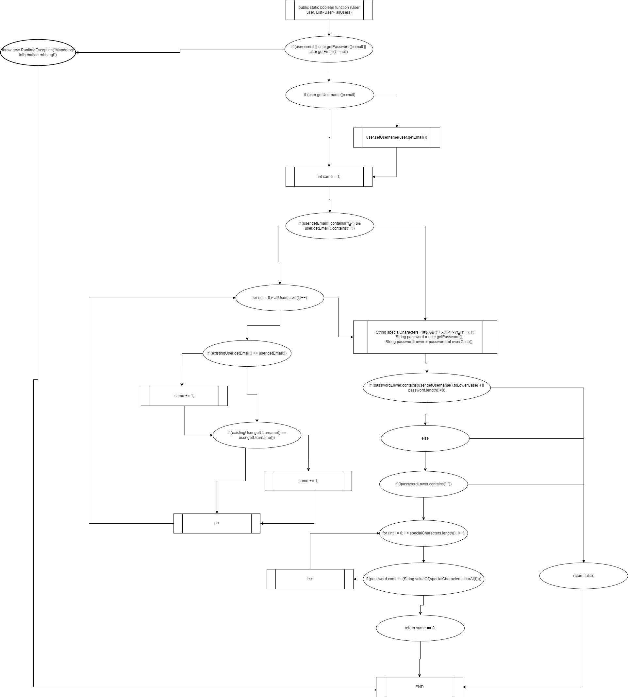

# SI_2023_lab2_212088

#Ведран Илиевски 212088

#Control Flow Graph

#Цикломатска комплексност
Од броење на региони
цикломатската комплексност = 11

#Тест случаи според критериумот Every statement
1.Тест случај за првиот if (mandatory information missing):

Влез: user = null, allUsers = [user1, user2]
Во овој тест случај, го поставивме user на нула за да симулираме сценарио каде 
недостасуваат задолжителни информации. Исто така обезбедуваме непразна листа на allUsers. 
Кодот треба да фрли RuntimeException со пораката 
Mandatory information missing! бидејќи user е null.

2.Тест случај за вториот if (username is null):

Влез: user = new User(null, "password123", "user@email.com"), allUsers = []
Овде, создаваме user со null username, но валидни вредности за password и email. 
allUsers е празна. Кодот треба да го постави username на user на вредноста на 
полето за email (бидејќи user.getUsername() е null). 

3.Тест случај за третиот if (email validation and existing user check):

Влез: user = new User("username1", "password123", "user@email.com"), allUsers = [user1, user2]
Во овој тест, креираме user со важечко username, password и email. 
allUsers содржи уште две users. Целта на овој тест случај е да се провери валидацијата 
на email и постоечката логика за проверка на user. 
Очекуваното однесување е дека истата променлива треба да се зголеми за секој постоечки user
кој го има истиот email или username како тековниот user. Во овој случај, 
бидејќи има еден user со ист email и нема user со исто username, 
same треба да биде еднакво на 1.

4.Тест случај за четвртиот if (password validation):

Влез: user = new User("username1", "passwr", "user@email.com"), allUsers = []
Овде, обезбедуваме user со важечко username и email, 
но password е премногу кратка (помалку од 8 знаци). кодот треба да врати false бидејќи 
должината на password е помала од 8 знаци.

5.Тест случај петиот if (password validation with a space):

Влез: user = new User("username1", "password 123", "user@email.com"), allUsers = []
Во овој тест случај, обезбедуваме user со важечко username, email и 
password што содржи празно место. allUsers е празен. Целта на овој тест случај 
е да се провери логиката за валидација на password кога има празно место во password. 
кодот треба да врати false бидејќи password содржи празно место.

6.Тест случај за else (password validation with special characters):

Влез: user = new User("username1", "p@ssw0rd123", "user@email.com"), allUsers = []
Овој тест случај ја проверува логиката за валидација на password кога должината на password 
е доволна (8 знаци или повеќе) и содржи специјални знаци. Овде, user има важечко 
username , password со специјални знаци и валиден email.  
кодот треба да врати true бидејќи password го исполнува условот 
за должина и содржи најмалку еден специјален знак.

#Тест случаи според критериумот Every path
1.Тест случај со валидни влезни податоци
Влез:
User user = new User("user", "Pass1234", "user@email.com");
List<User> allUsers = Arrays.asList(
    new User("user1", "Pass5678", "user1@email.com"),
    new User("user2", "Pass9012", "user2@email.com")
);
Објаснување:
Во овој тест случај, се создава објект од класата User со валидно корисничко име, лозинка и е-пошта.
Листата allUsers содржи два постоечки корисници.
Очекуваниот излез е true бидејќи влезниот корисник има валидни информации и не се конфликтира со никој од постоечките корисници.

2.Тест случај со null user
Влез:
User user = null;
List<User> allUsers = Arrays.asList(
    new User("user1", "Pass5678", "user1@email.com"),
    new User("user2", "Pass9012", "user2@email.com")
);
Објаснување:
Во овој тест случај, објектот корисник е поставен на null.
Листата allUsers содржи два постоечки корисници.
Очекуваниот излез е RuntimeException со пораката "Mandatory information missing!" бидејќи објектот корисник е null.

3.Тест случај со null password
Влез:
User user = new User("user", null, "user@email.com");
List<User> allUsers = Arrays.asList(
    new User("user1", "Pass5678", "user1@email.com"),
    new User("user2", "Pass9012", "user2@email.com")
);
Објаснување:
Во овој тест случај, лозинката на објектот корисник е поставена на null.
Листата allUsers содржи два постоечки корисници.
Очекуваниот излез е RuntimeException со пораката "Mandatory information missing!" бидејќи лозинката е null.

4.Тест случај со null email
Влез:
User user = new User("user", "Pass1234", null);
List<User> allUsers = Arrays.asList(
    new User("user1", "Pass5678", "user1@email.com"),
    new User("user2", "Pass9012", "user2@email.com")
);
Објаснување:
Во овој тест случај, е-поштата на објектот корисник е поставена на null.
Листата allUsers содржи два постоечки корисници.
Очекуваниот излез е RuntimeException со пораката "Mandatory information missing!" бидејќи е-поштата е null.

5.Тест случај со null username
Влез:
User user = new User(null, "Pass1234", "user@email.com");
List<User> allUsers = Arrays.asList(
    new User("user1", "Pass5678", "user1@email.com"),
    new User("user2", "Pass9012", "user2@email.com")
);
Објаснување:
Во овој тест случај, корисничкото име на објектот корисник е поставено на null.
Листата allUsers содржи два постоечки корисници.
Очекуваниот излез е true бидејќи корисничкото име е null, а во тој случај, корисничкото име се поставува како е-пошта.

6.Тест случај со email која веќе постои во allUsers
Влез:
User user = new User("user", "Pass1234", "user1@email.com");
List<User> allUsers = Arrays.asList(
    new User("user1", "Pass5678", "user1@email.com"),
    new User("user2", "Pass9012", "user2@email.com")
);
Објаснување:
Во овој тест случај, објектот корисник има е-пошта која веќе постои во листата allUsers.
Листата allUsers содржи два постоечки корисници, од кои едниот има иста е-пошта како објектот корисник.
Очекуваниот излез е false бидејќи е-поштата не е уникатна меѓу корисниците.

7.Тест случај со username кое веќе постои во allUsers
Влез:
User user = new User("user1", "Pass1234", "user@email.com");
List<User> allUsers = Arrays.asList(
    new User("user1", "Pass5678", "user1@email.com"),
    new User("user2", "Pass9012", "user2@email.com")
);
Објаснување:
Во овој тест случај, објектот корисник има корисничко име кое веќе постои во листата allUsers.
Листата allUsers содржи два постоечки корисници, од кои едниот има исто корисничко име како објектот корисник.
Очекуваниот излез е false бидејќи корисничкото име не е уникатно меѓу корисниците.

8.Тест случај со password која содржи username
Влез:
User user = new User("user", "user1234", "user@email.com");
List<User> allUsers = Arrays.asList(
    new User("user1", "Pass5678", "user1@email.com"),
    new User("user2", "Pass9012", "user2@email.com")
);
Објаснување:
Во овој тест случај, лозинката на објектот корисник содржи корисничкото име.
Листата allUsers содржи два постоечки корисници.
Очекуваниот излез е false бидејќи лозинката не треба да содржи корисничкото име.

9.Тест случај со password со должина помала од 8 знаци
Влез:
User user = new User("user", "Pass1", "user@email.com");
List<User> allUsers = Arrays.asList(
    new User("user1", "Pass5678", "user1@email.com"),
    new User("user2", "Pass9012", "user2@email.com")
);
Објаснување:
Во овој тест случај, лозинката на објектот корисник има должина помала од 8 знаци.
Листата allUsers содржи два постоечки корисници.
Очекуваниот излез е false бидејќи лозинката треба да има минимална должина од 8 знаци.

10.Тест случај со password која содржи празно место
Влез:
User user = new User("user", "Pass 1234", "user@email.com");
List<User> allUsers = Arrays.asList(
    new User("user1", "Pass5678", "user1@email.com"),
    new User("user2", "Pass9012", "user2@email.com")
);
Објаснување:
Во овој тест случај, лозинката на објектот корисник содржи празно место.
Листата allUsers содржи два постоечки корисници.
Очекуваниот излез е false бидејќи лозинката не треба да содржи празни места.

11.Тест случај со валиден формат на email, без постоечки users
Влез:
User user = new User("user", "Pass1234", "user@email.com");
List<User> allUsers = new ArrayList<>();
Објаснување:
Во овој тест случај, објектот корисник има валиден формат на е-пошта.
Листата allUsers е празна, односно нема постоечки корисници.
Очекуваниот излез е true бидејќи нема конфликти со постоечки корисници.

12.Тест случај со валиден формат на email, username веќе постои
Влез:
User user = new User("user", "Pass1234", "user@email.com");
List<User> allUsers = Arrays.asList(
    new User("user", "Pass5678", "user1@email.com"),
    new User("user2", "Pass9012", "user2@email.com")
);
Објаснување:
Во овој тест случај, објектот корисник има валиден формат на е-пошта.
Листата allUsers содржи два постоечки корисници, од кои едниот има исто корисничко име како објектот корисник.
Очекуваниот излез е false бидејќи корисничкото име не е уникатно меѓу корисниците.

13.Тест случај со невалиден формат на email
Влез:
User user = new User("user", "Pass1234", "user@email");
List<User> allUsers = Arrays.asList(
    new User("user1", "Pass5678", "user1@email.com"),
    new User("user2", "Pass9012", "user2@email.com")
);
Објаснување:
Во овој тест случај, објектот корисник има невалиден формат на е-пошта (недостасува доменот).
Листата allUsers содржи два постоечки корисници.
Очекуваниот излез е false бидејќи форматот на е-поштата е невалиден.

14.Тест случај со валиден формат на email, која веќе постои во allUsers
Влез:
User user = new User("user", "Pass1234", "user1@email.com");
List<User> allUsers = Arrays.asList(
    new User("user1", "Pass5678", "user1@email.com"),
    new User("user2", "Pass9012", "user2@email.com")
);
Објаснување:
Во овој тест случај, објектот корисник има валиден формат на е-пошта.
Листата allUsers содржи два постоечки корисници, од кои едниот има иста е-пошта како објектот корисник.
Очекуваниот излез е false бидејќи е-поштата не е уникатна меѓу корисниците.

15.Тест случај со валиден формат на email и уникатно username
Влез:
User user = new User("user", "Pass1234", "user@email.com");
List<User> allUsers = Arrays.asList(
    new User("user1", "Pass5678", "user1@email.com"),
    new User("user2", "Pass9012", "user2@email.com")
);
Објаснување:
Во овој тест случај, објектот корисник има валиден формат на е-пошта и уникатно корисничко име.
Листата allUsers содржи два постоечки корисници.
Очекуваниот излез е true бидејќи е-поштата е уникатна, а исто така и корисничкото име е уникатно меѓу корисниците.

16.Тест случај со валиден формат на email, password која го содржи username и специјален знак
Влез:
User user = new User("user", "user1234!", "user@email.com");
List<User> allUsers = Arrays.asList(
    new User("user1", "Pass5678", "user1@email.com"),
    new User("user2", "Pass9012", "user2@email.com")
);
Објаснување:
Во овој тест случај, објектот корисник има валиден формат на е-пошта, лозинка која го содржи корисничкото име и еден специјален знак.
Листата allUsers содржи два постоечки корисници.
Очекуваниот излез е false бидејќи лозинката не треба да го содржи корисничкото име.

17.Тест случај со валиден формат на email, password со должина помала од 8 знаци и специјален знак
Влез:
User user = new User("user", "Pa1!", "user@email.com");
List<User> allUsers = Arrays.asList(
    new User("user1", "Pass5678", "user1@email.com"),
    new User("user2", "Pass9012", "user2@email.com")
);
Објаснување:
Во овој тест случај, објектот корисник има валиден формат на е-пошта, лозинка со должина помала од 8 знаци и еден специјален знак.
Листата allUsers содржи два постоечки корисници.
Очекуваниот излез е false бидејќи лозинката треба да има минимална должина од 8 знаци.
